### Config ssh:
   1. cd ~/.ssh
   2. ssh-keygen -o
   3. cat ~/.ssh/id_rsa.pub

### Create local branch and push it to the origin branch
   1. git branch develop
   2. git commit -m ""
   3. git push origin develop:develop

https://learngitbranching.js.org/?locale=zh_CN

### Git Commit
Git 仓库中的提交记录保存的是你的目录下所有文件的快照，就像是把整个目录复制，然后再粘贴一样，但比复制粘贴优雅许多！
Git 希望提交记录尽可能地轻量，因此在你每次进行提交时，它并不会盲目地复制整个目录。条件允许的情况下，它会将当前版本与仓库中的上一个版本进行对比，并把所有的差异打包到一起作为一个提交记录。


### Git Branch
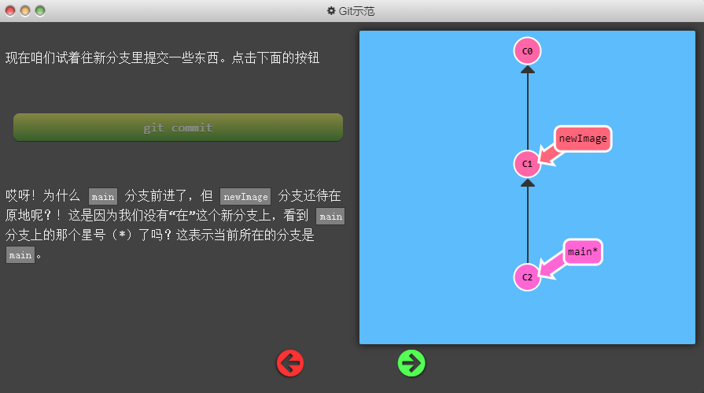

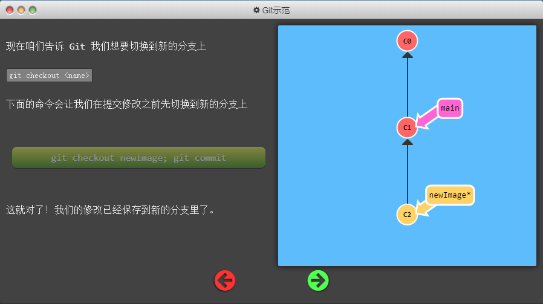

```
git checkout -b <your-branch-name>
```

### Git merge
```
git merge bugFix
```
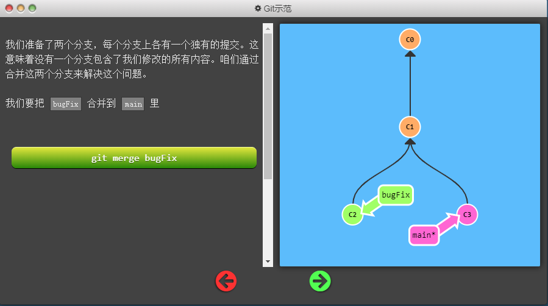
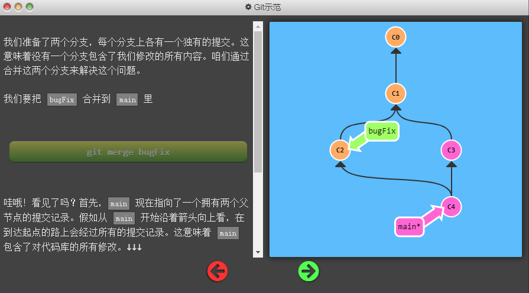
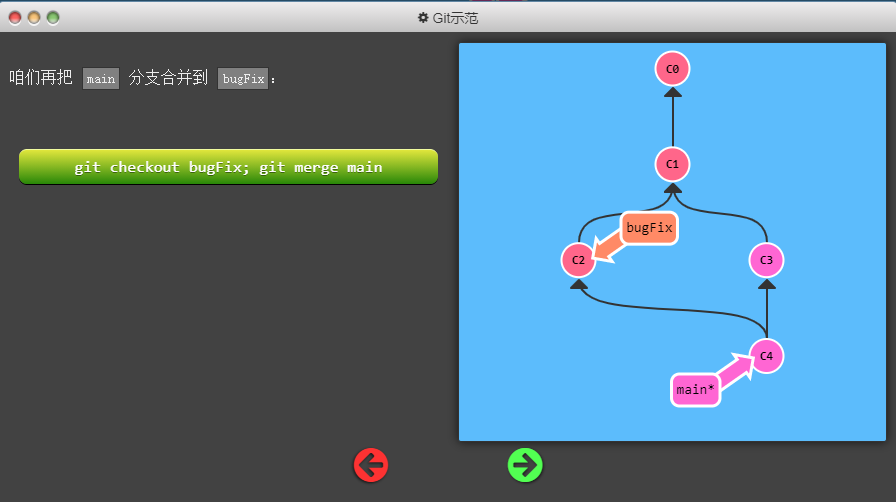
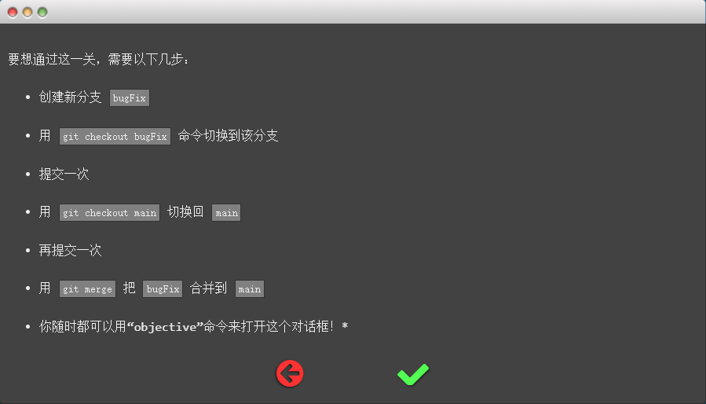

### Git rebase
第二种合并分支的方法是 git rebase。Rebase 实际上就是取出一系列的提交记录，“复制”它们，然后在另外一个地方逐个的放下去。
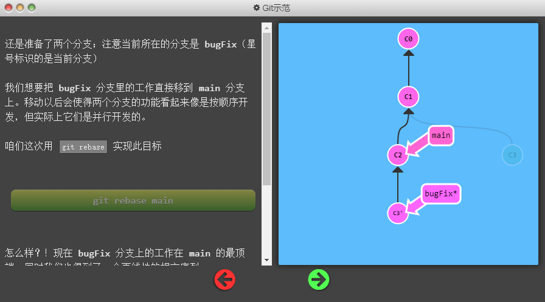
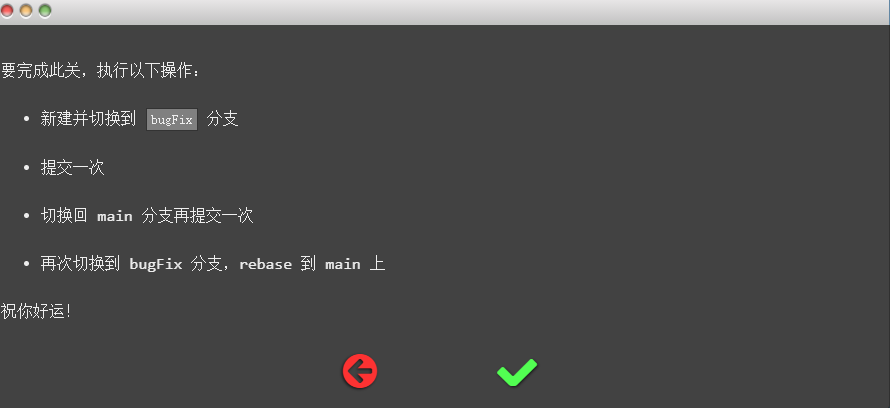

```
git branch bugFix
git checkout bugFix
git commit -m "bugFix commit"
git checkout main
git commit -m "main commit"
git checkout bugFix
git rebase main
```

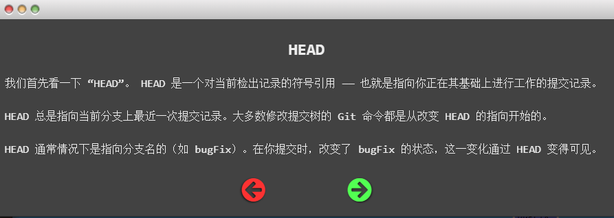


```
cat .git/HEAD 
git symbolic-ref HEAD
```
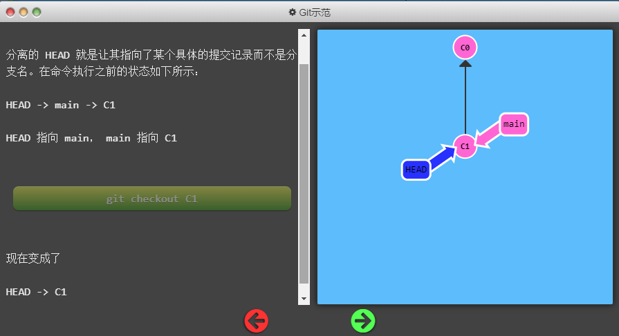
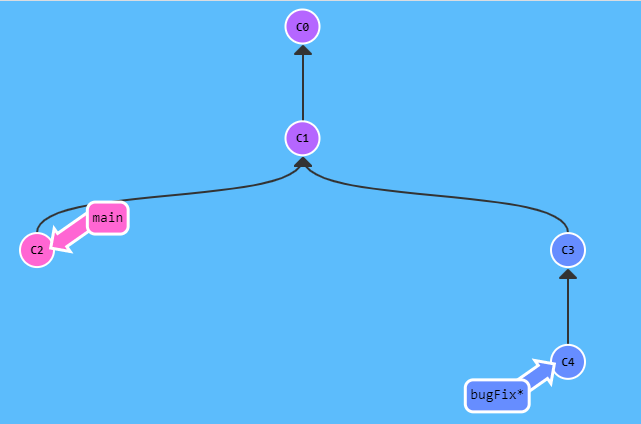
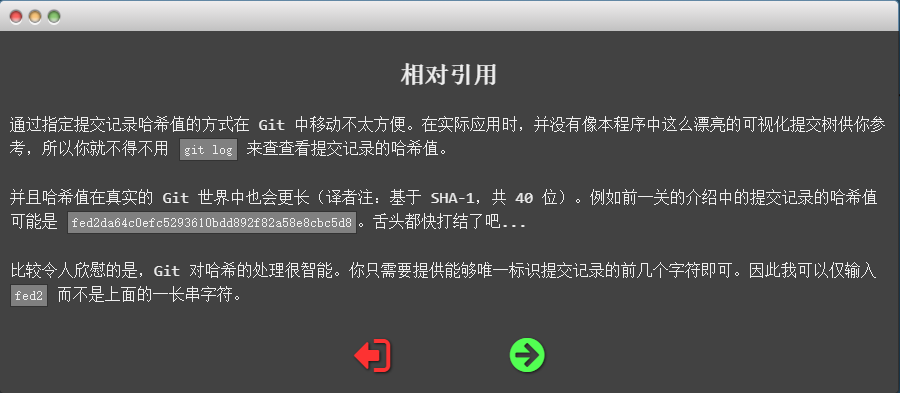
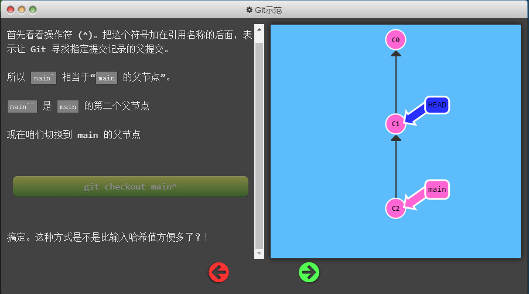
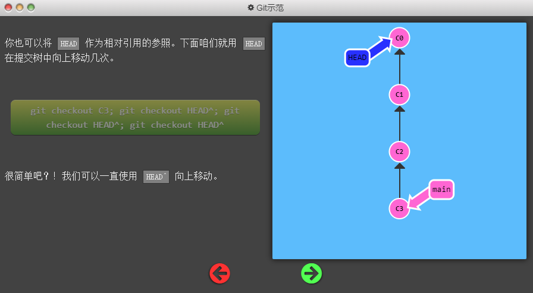
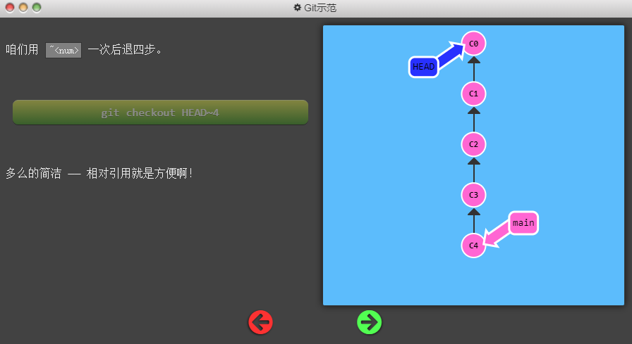
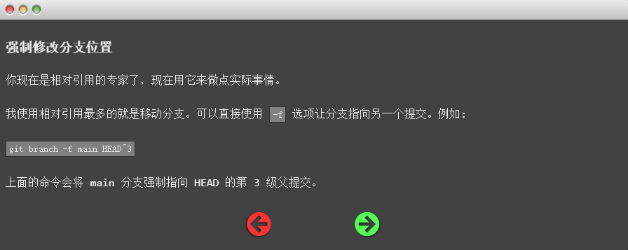
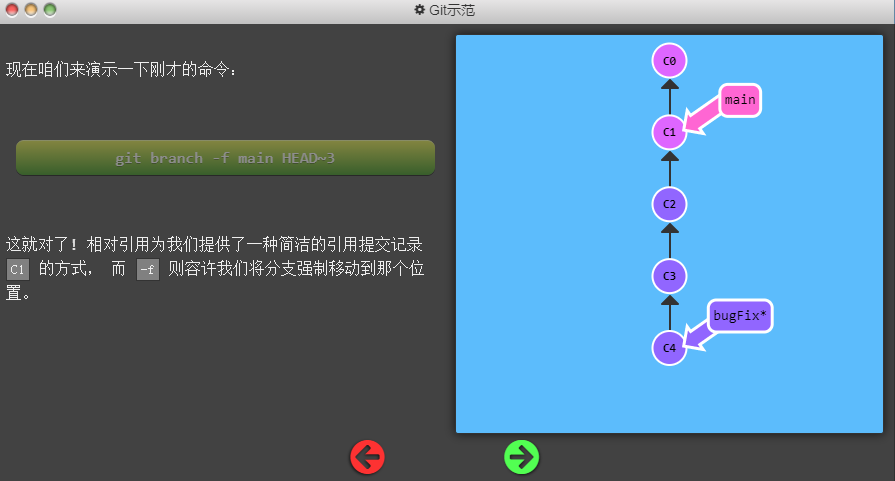