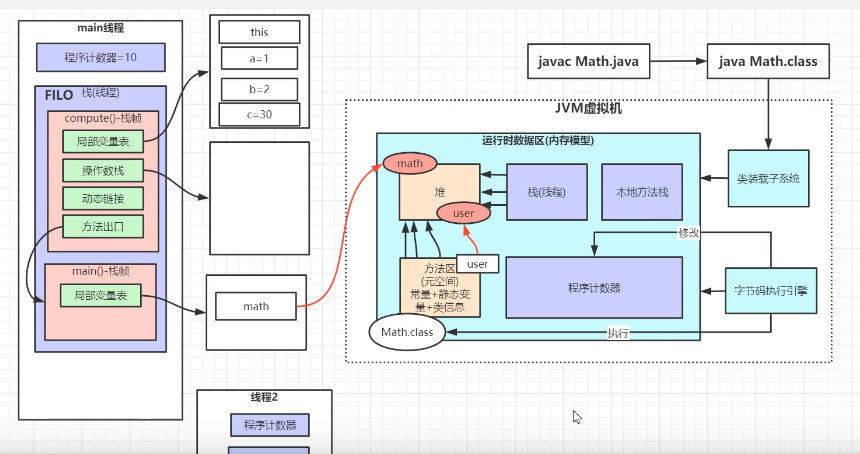
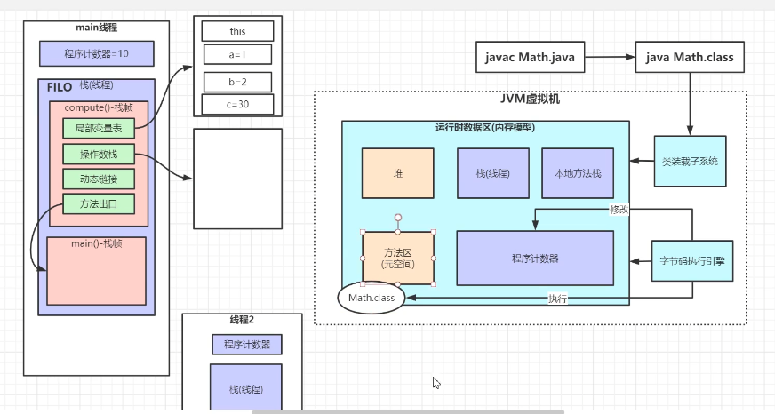
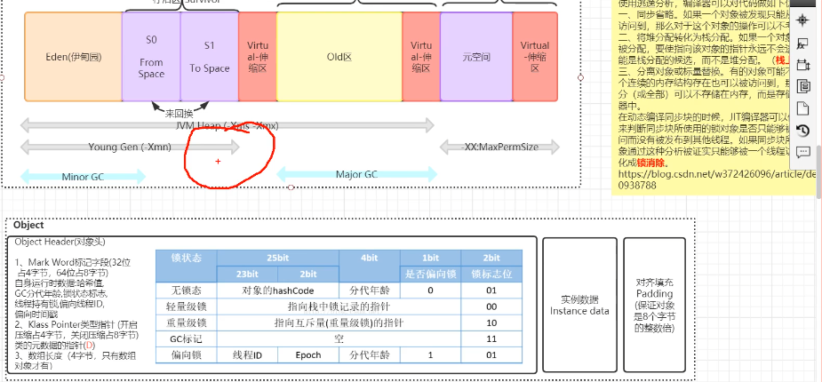
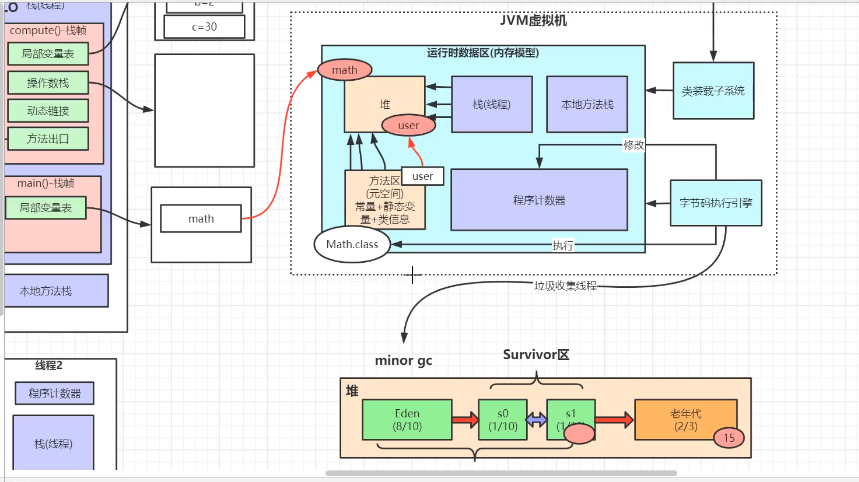
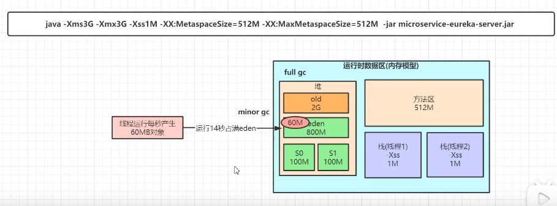
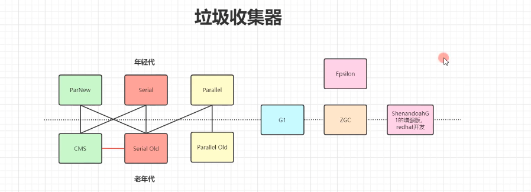
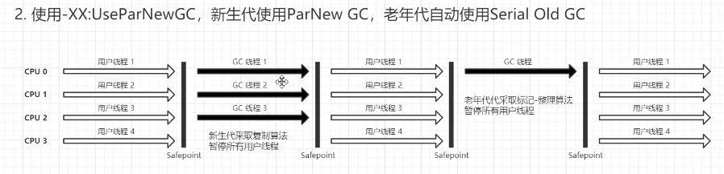
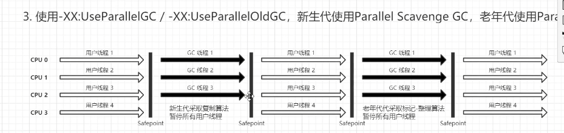
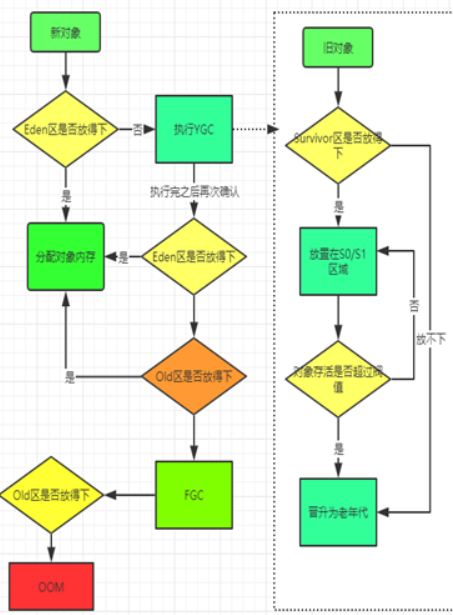

-XX:+UseConcMarkSweepGC -XX:+UseParNewGC -XX:+PrintFlagsFinal -XX:+PrintGCDetails
-XX:+PrintGCDateStamps -XX:+PrintGCApplicationStoppedTime

```
InitialHeapSize                          := 536870912     512M * 64 =32GB

 uintx MaxHeapSize                              := 4282384384    4GB * 8=32GB

uintx MaxMetaspaceSize                          = 4294901760  4GB * 8=32GB

uintx MaxNewSize                               := 2858942464 

uintx MetaspaceSize                             = 21807104  
 uintx NewSize                                  := 178782208  170.5M
uintx OldSize                                  := 358088704  341.5M
NewRatio=2
InitialHeapSize  = NewSize +  OldSize

MaxMetaspaceSize =1/4 * 32
```

```

New Generation（新生代）内存大小设置
    -Xmn256m 设置JVM的新生代内存大小（－Xmn 是将NewSize与MaxNewSize设为一致。256m）,同下面两个参数

-XX:NewSize=256m -XX:MaxNewSize=256m
还可以通过新生代和老年代内存的比值来设置新生代大小-XX:NewRatio=3
设置新生代（包括Eden和两个Survivor区）与老年代的比值（除去持久代）。设置为3，则新生代与老年代所占比值为1：3，新生代占整个堆栈的1/4

Survivor内存大小设置 -XX:SurvivorRatio=8
设置为8,则两个Survivor区与一个Eden区的比值为2:8,一个Survivor区占整个新生代的1/10

java -Xms20m -Xmn10M -XX:SurvivorRatio=2 -XX:+PrintGCDetails GCDemo
java -XX:MetaspaceSize=10m -XX:MaxMetaspaceSize=50m -XX:+PrintGCDetails GCDemo
从上面的执行结果可以看到，Metaspace 空间的大小为 2.6M 左右，并不是我们设置的 10M。那是因为 MetaspaceSize 设置的是元空间发生 GC 的初始阈值。
当达到这个值时，元空间发生 GC 操作，这个值默认是 20.8M。
而 MaxMetaspaceSize 则是设置元空间的最大大小，
默认基本是机器的物理内存大小。虽然可以不设置，
但还是建议设置一下，因为如果一直不断膨胀，那么 JVM 进程可能会被 OS kill 掉。
参数	含义
-Xms	             初始堆大小
-Xmx	             最大堆空间
-Xmn	             设置新生代大小
-XX:SurvivorRatio	 设置新生代eden空间和from/to空间的比例关系
-XX:PermSize	     方法区初始大小
-XX:MaxPermSize	     方法区最大大小
-XX:MetaspaceSize	 元空间GC阈值（JDK1.8）
-XX:MaxMetaspaceSize 最大元空间大小（JDK1.8）
-Xss	              栈大小
-XX:MaxDirectMemorySize	直接内存大小，默认为最大堆空间
```
* https://www.cnblogs.com/xifengxiaoma/p/9415357.html



jvisualvm
### 调优工具 -Arthas
https://arthas.gitee.io/download.html
https://arthas.gitee.io/quick-start.html





###单独调试openjdk



####5.1.调优的步骤
* a.熟悉业务场景（没有最好的垃圾回收器，只有最合适的垃圾回收器）
* b.了解程序的响应时间、停顿时间
* c.调研吞吐量 = 用户时间 / 用户时间 + GC时间
* d.选择回收器组合
* e.计算内存需求
* f.设定年代大小、升级年龄
* g.设定日志参数
```-Xloggc:/opt/xxx/logs/xxx-xxx-gc-%t.log 
   -XX:+UseGCLogFileRotation
  -XX:NumberOfGCLogFiles=5
  -XX:GCLogFileSize=20M 
  -XX:+PrintGCDetails 
  -XX:+PrintGCDateStamps 
  -XX:+PrintGCCause
``` 

```-Xmx

　　指定java程序的最大堆内存, 使用java -Xmx5000M -version判断当前系统能分配的最大堆内存

-Xms

　　指定最小堆内存, 通常设置成跟最大堆内存一样，减少GC

-Xmn

　　设置年轻代大小。整个堆大小=年轻代大小 + 年老代大小。所以增大年轻代后，将会减小年老代大小。此值对系统性能影响较大，Sun官方推荐配置为整个堆的3/8。

-Xss

　　指定线程的最大栈空间, 此参数决定了java函数调用的深度, 值越大调用深度越深, 若值太小则容易出栈溢出错误(StackOverflowError)

-XX:PermSize

　　指定方法区(永久区)的初始值,默认是物理内存的1/64， 在Java8永久区移除, 代之的是元数据区， 由-XX:MetaspaceSize指定

-XX:MaxPermSize

　　指定方法区的最大值, 默认是物理内存的1/4， 在java8中由-XX:MaxMetaspaceSize指定元数据区的大小

-XX:NewRatio=n

　　年老代与年轻代的比值，-XX:NewRatio=2, 表示年老代与年轻代的比值为2:1

-XX:SurvivorRatio=n

　　Eden区与Survivor区的大小比值，-XX:SurvivorRatio=8表示Eden区与Survivor区的大小比值是8:1:1，因为Survivor区有两个(from, to)
```