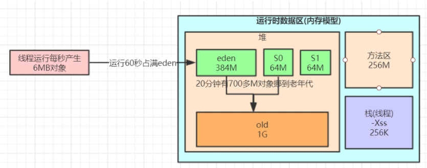
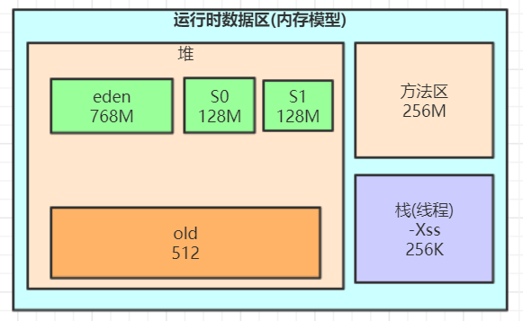

https://blog.csdn.net/wangzhipeng47/article/details/107651678?utm_medium=distribute.pc_relevant.none-task-blog-2~default~baidujs_baidulandingword~default-0.control&spm=1001.2101.3001.4242
```
jps
jinfo pid
jstat -gc pid: 
    S0C：第一个幸存区的大小，单位KB
    S1C：第二个幸存区的大小
    S0U：第一个幸存区的使用大小
    S1U：第二个幸存区的使用大小
    EC：伊甸园区的大小
    EU：伊甸园区的使用大小
    OC：老年代大小
    OU：老年代使用大小
    MC：方法区大小(元空间)
    MU：方法区使用大小
    CCSC:压缩类空间大小
    CCSU:压缩类空间使用大小
    YGC：年轻代垃圾回收次数
    YGCT：年轻代垃圾回收消耗时间，单位s
    FGC：老年代垃圾回收次数
    FGCT：老年代垃圾回收消耗时间，单位s
    GCT：垃圾回收消耗总时间，单位s

jstat -gccapacity pid
jstat -gcnew pid
jstat -gcnewcapacity pid
jstat -gcold pid
jstat -gcoldcapacity pid
jstat -gcmetacapacity pid

```
```
JVM运行情况预估
用 jstat gc -pid 命令可以计算出如下一些关键数据，有了这些数据就可以采用之前介绍过的优化思路，先给自己的系统设置一些初始性的JVM参数，比如堆内存大小，年轻代大小，Eden和Survivor的比例，老年代的大小，大对象的阈值，大龄对象进入老年代的阈值等。

年轻代对象增长的速率

可以执行命令 jstat -gc pid 1000 10 (每隔1秒执行1次命令，共执行10次)，通过观察EU(eden区的使用)来估算每秒eden大概新增多少对象，如果系统负载不高，可以把频率1秒换成1分钟，甚至10分钟来观察整体情况。注意，一般系统可能有高峰期和日常期，所以需要在不同的时间分别估算不同情况下对象增长速率。

Young GC的触发频率和每次耗时

知道年轻代对象增长速率我们就能推根据eden区的大小推算出Young GC大概多久触发一次，Young GC的平均耗时可以通过 YGCT/YGC 公式算出，根据结果我们大概就能知道系统大概多久会因为Young GC的执行而卡顿多久。

每次Young GC后有多少对象存活和进入老年代

这个因为之前已经大概知道Young GC的频率，假设是每5分钟一次，那么可以执行命令 jstat -gc pid 300000 10 ，观察每次结果eden，survivor和老年代使用的变化情况，在每次gc后eden区使用一般会大幅减少，survivor和老年代都有可能增长，这些增长的对象就是每次Young GC后存活的对象，同时还可以看出每次Young GC后进去老年代大概多少对象，从而可以推算出老年代对象增长速率。

Full GC的触发频率和每次耗时

知道了老年代对象的增长速率就可以推算出Full GC的触发频率了，Full GC的每次耗时可以用公式 FGCT/FGC 计算得出。

优化思路其实简单来说就是尽量让每次Young GC后的存活对象小于Survivor区域的50%，都留存在年轻代里。尽量别让对象进入老年代。尽量减少Full GC的频率，避免频繁Full GC对JVM性能的影响。

系统频繁Full GC导致系统卡顿是怎么回事

机器配置：2核4G
JVM内存大小：2G
系统运行时间：7天
期间发生的Full GC次数和耗时：500多次，200多秒
期间发生的Young GC次数和耗时：1万多次，500多秒
 
大致算下来每天会发生70多次Full GC，平均每小时3次，每次Full GC在400毫秒左右；

每天会发生1000多次Young GC，每分钟会发生1次，每次Young GC在50毫秒左右。

JVM参数设置如下：

-Xms1536M -Xmx1536M -Xmn512M -Xss256K -XX:SurvivorRatio=6  -XX:MetaspaceSize=256M -XX:MaxMetaspaceSize=256M 
-XX:+UseParNewGC  -XX:+UseConcMarkSweepGC  -XX:CMSInitiatingOccupancyFraction=75 -XX:+UseCMSInitiatingOccupancyOnly 

```

```对于对象动态年龄判断机制导致的full gc较为频繁可以先试着优化下JVM参数，把年轻代适当调大点：

-Xms1536M -Xmx1536M -Xmn1024M -Xss256K -XX:SurvivorRatio=6  -XX:MetaspaceSize=256M -XX:MaxMetaspaceSize=256M 
-XX:+UseParNewGC  -XX:+UseConcMarkSweepGC  -XX:CMSInitiatingOccupancyFraction=92 -XX:+UseCMSInitiatingOccupancyOnly
```

```
我们可以推测下full gc比minor gc还多的原因有哪些？

1、元空间不够导致的多余full gc

2、显示调用System.gc()造成多余的full gc，这种一般线上尽量通过-XX:+DisableExplicitGC参数禁用，如果加上了这个JVM启动参数，那么代码中调用System.gc()没有任何效果

3、老年代空间分配担保机制

最快速度分析完这些我们推测的原因以及优化后，我们发现young gc和full gc依然很频繁了，而且看到有大量的对象频繁的被挪动到老年代，这种情况我们可以借助jmap命令大概看下是什么对象
我们可以推测下full gc比minor gc还多的原因有哪些？

1、元空间不够导致的多余full gc

2、显示调用System.gc()造成多余的full gc，这种一般线上尽量通过-XX:+DisableExplicitGC参数禁用，如果加上了这个JVM启动参数，那么代码中调用System.gc()没有任何效果

3、老年代空间分配担保机制

```

* 1.通过top指令发现，当前5511的线程cup和内存的使用率过高：
* 2. 查询当前java进程详情，利用 jinfo pid 5511
* 3. Command line 可以看出JVM 用户输入参，对整个jvm的信息进行消息的描述
* VM Flags:Non-default VM flags: -XX:+AggressiveOpts -XX:CICompilerCount=4 -XX:CMSInitiatingOccupancyFraction=75 -XX:+CMSParallelRemarkEnabled -XX:+DisableExplicitGC -XX:InitialHeapSize=6442450944 -XX:MaxDirectMemorySize=1073741824 -XX:MaxHeapSize=6442450944 -XX:MaxNewSize=697892864 -XX:MaxTenuringThreshold=6 -XX:MinHeapDeltaBytes=196608 -XX:NewSize=697892864 -XX:OldPLABSize=16 -XX:OldSize=5744558080 -XX:+PrintGCApplicationStoppedTime -XX:+PrintGCDetails -XX:+PrintGCTimeStamps -XX:ThreadStackSize=256 -XX:+UseBiasedLocking -XX:+UseCMSCompactAtFullCollection -XX:+UseCMSInitiatingOccupancyOnly -XX:+UseCompressedClassPointers -XX:+UseCompressedOops -XX:+UseConcMarkSweepGC -XX:+UseFastAccessorMethods -XX:+UseParNewGC
* Command line:  -Xms6G -Xmx6G -XX:MaxPermSize=256M -XX:MaxDirectMemorySize=1G -Xss256k -XX:+AggressiveOpts -XX:+UseBiasedLocking -XX:+UseFastAccessorMethods -XX:+DisableExplicitGC -XX:+UseParNewGC -XX:+UseConcMarkSweepGC -XX:+CMSParallelRemarkEnabled -XX:+UseCMSCompactAtFullCollection -XX:+UseCMSInitiatingOccupancyOnly -XX:CMSInitiatingOccupancyFraction=75 -XX:CMSInitiatingOccupancyFraction=75 -XX:+PrintGCApplicationStoppedTime -XX:+PrintGCTimeStamps -XX:+PrintGCDetails

* 4.查看当前gc情况： jstat gcacuse 5511
```[root@bigdata-service-1:/root]# jstat -gccause 5511 1000
  S0     S1     E      O      M     CCS    YGC     YGCT    FGC    FGCT     GCT    LGCC                 GCC                 
  0.00   8.86  61.50  72.16  95.05  91.62   4577  326.410     8    8.855  335.265 Allocation Failure   No GC               
  0.00   8.86  64.31  72.16  95.05  91.62   4577  326.410     8    8.855  335.265 Allocation Failure   No GC               
  0.00   8.86  65.04  72.16  95.05  91.62   4577  326.410     8    8.855  335.265 Allocation Failure   No GC               
  0.00   8.86  65.17  72.16  95.05  91.62   4577  326.410     8    8.855  335.265 Allocation Failure   No GC               
  0.00   8.86  65.26  72.16  95.05  91.62   4577  326.410     8    8.855  335.265 Allocation Failure   No GC               
  0.00   8.86  65.26  72.16  95.05  91.62   4577  326.410     8    8.855  335.265 Allocation Failure   No GC               
  0.00   8.86  67.80  72.16  95.05  91.62   4577  326.410     8    8.855  335.265 Allocation Failure   No GC 
发现新生代频繁的进行gc操【YGC：gc 次数, YGCT： gc时间】，
老年的几乎没有gc【FGC：full gc次数，FGCT ：full gc时间】，
可能原因是新生代的设计过小，导致新生代频繁gc
```

* 查看当前jvm 内存分配： jmap -heap 5511
```[root@bigdata-service-1:/root]# jmap -heap 5511
Attaching to process ID 5511, please wait...
Debugger attached successfully.
Server compiler detected.
JVM version is 25.151-b12

using parallel threads in the new generation.
using thread-local object allocation.
Concurrent Mark-Sweep GC

Heap Configuration:
   MinHeapFreeRatio         = 40
   MaxHeapFreeRatio         = 70
   MaxHeapSize              = 6442450944 (6144.0MB)
   NewSize                  = 697892864 (665.5625MB)
   MaxNewSize               = 697892864 (665.5625MB)
   OldSize                  = 5744558080 (5478.4375MB)
   NewRatio                 = 2
   SurvivorRatio            = 8
   MetaspaceSize            = 21807104 (20.796875MB)
   CompressedClassSpaceSize = 1073741824 (1024.0MB)
   MaxMetaspaceSize         = 17592186044415 MB
   G1HeapRegionSize         = 0 (0.0MB)

Heap Usage:
New Generation (Eden + 1 Survivor Space):
   capacity = 628162560 (599.0625MB)
   used     = 210724080 (200.96214294433594MB)
   free     = 417438480 (398.10035705566406MB)
   33.54610628178795% used
Eden Space:
   capacity = 558432256 (532.5625MB)
   used     = 203572032 (194.14141845703125MB)
   free     = 354860224 (338.42108154296875MB)
   36.45420367694519% used
From Space:
   capacity = 69730304 (66.5MB)
   used     = 7152048 (6.8207244873046875MB)
   free     = 62578256 (59.67927551269531MB)
   10.256728552337876% used
To Space:
   capacity = 69730304 (66.5MB)
   used     = 0 (0.0MB)
   free     = 69730304 (66.5MB)
   0.0% used
concurrent mark-sweep generation:
   capacity = 5744558080 (5478.4375MB)
   used     = 4145940376 (3953.876853942871MB)
   free     = 1598617704 (1524.560646057129MB)
   72.17161561016022% used

32720 interned Strings occupying 4008568 bytes.
从JVM的分配可以看出，新生代分配：capacity = 628162560 (599.0625MB)，
Eden Space：capacity = 558432256 (532.5625MB)，
老年代分配：capacity = 5744558080 (5478.4375MB)。
从数据分析出，新生代设计过小，导致新生代频繁gc。其
次，新生代设计过小，导致大对象无法分配，直接分配到老年代。
导致老年代空间占用过大，从而占用整个系统内存空间。可能导致其他服务内存不足。

```

* 线上手动GC，查看GC后的JVM详情信息
```[root@bigdata-service-1:/root]# jmap -histo:live 5511
日志过大.....

[root@bigdata-service-1:/root]# jstat -gc 5511 1000
 S0C    S1C    S0U    S1U      EC       EU        OC         OU       MC     MU    CCSC   CCSU   YGC     YGCT    FGC    FGCT     GCT   
68096.0 68096.0 7588.1  0.0   545344.0 394801.0 5609920.0  4050654.1  87952.0 83637.7 11392.0 10437.9   4592  327.582   9      8.855  336.437
68096.0 68096.0  0.0    0.0   545344.0   0.0    5609920.0  4043257.0  87952.0 83637.7 11392.0 10437.9   4592  327.582   9     12.997  340.578
68096.0 68096.0  0.0    0.0   545344.0 46918.8  5609920.0  4043257.0  87952.0 83637.7 11392.0 10437.9   4592  327.582   9     12.997  340.578
68096.0 68096.0  0.0    0.0   545344.0 46922.8  5609920.0  4043257.0  87952.0 83637.7 11392.0 10437.9   4592  327.582   9     12.997  340.578
68096.0 68096.0  0.0    0.0   545344.0 46937.1  5609920.0  4043257.0  87952.0 83637.7 11392.0 10437.9   4592  327.582   9     12.997  340.578
68096.0 68096.0  0.0    0.0   545344.0 46937.1  5609920.0  4043257.0  87952.0 83637.7 11392.0 10437.9   4592  327.582   9     12.997  340.578
68096.0 68096.0  0.0    0.0   545344.0 46937.1  5609920.0  4043257.0  87952.0 83637.7 11392.0 10437.9   4592  327.582   9     12.997  340.578
68096.0 68096.0  0.0    0.0   545344.0 64190.0  5609920.0  4043257.0  87952.0 83637.7 11392.0 10437.9   4592  327.582   9     12.997  340.578
68096.0 68096.0  0.0    0.0   545344.0 64190.0  5609920.0  4043257.0  87952.0 83637.7 11392.0 10437.9   4592  327.582   9     12.997  340.578
68096.0 68096.0  0.0    0.0   545344.0 64190.0  5609920.0  4043257.0  87952.0 83637.7 11392.0 10437.9   4592  327.582   9     12.997  340.578
68096.0 68096.0  0.0    0.0   545344.0 64190.0  5609920.0  4043257.0  87952.0 83637.7 11392.0 10437.9   4592  327.582   9     12.997  340.578
68096.0 68096.0  0.0    0.0   545344.0 64190.0  5609920.0  4043257.0  87952.0 83637.7 11392.0 10437.9   4592  327.582   9     12.997  340.578
68096.0 68096.0  0.0    0.0   545344.0 82152.3  5609920.0  4043257.0  87952.0 83637.7 11392.0 10437.9   4592  327.582   9     12.997  340.578
68096.0 68096.0  0.0    0.0   545344.0 82152.3  5609920.0  4043257.0  87952.0 83637.7 11392.0 10437.9   4592  327.582   9     12.997  340.578
68096.0 68096.0  0.0    0.0   545344.0 82152.3  5609920.0  4043257.0  87952.0 83637.7 11392.0 10437.9   4592  327.582   9     12.997  340.578
68096.0 68096.0  0.0    0.0   545344.0 82156.4  5609920.0  4043257.0  87952.0 83637.7 11392.0 10437.9   4592  327.582   9     12.997  340.578
68096.0 68096.0  0.0    0.0   545344.0 82156.4  5609920.0  4043257.0  87952.0 83637.7 11392.0 10437.9   4592  327.582   9     12.997  340.578
68096.0 68096.0  0.0    0.0   545344.0 101737.5 5609920.0  4043257.0  87952.0 83637.7 11392.0 10437.9   4592  327.582   9     12.997  340.578
68096.0 68096.0  0.0    0.0   545344.0 101737.5 5609920.0  4043257.0  87952.0 83637.7 11392.0 10437.9   4592  327.582   9     12.997  340.578
68096.0 68096.0  0.0    0.0   545344.0 103581.5 5609920.0  4043257.0  87952.0 83637.7 11392.0 10437.9   4592  327.582   9     12.997  340.578
68096.0 68096.0  0.0    0.0   545344.0 103581.5 5609920.0  4043257.0  87952.0 83637.7 11392.0 10437.9   4592  327.582   9     12.997  340.578
68096.0 68096.0  0.0    0.0   545344.0 103581.5 5609920.0  4043257.0  87952.0 83637.7 11392.0 10437.9   4592  327.582   9     12.997  340.578
68096.0 68096.0  0.0    0.0   545344.0 124812.4 5609920.0  4043257.0  87952.0 83637.7 11392.0 10437.9   4592  327.582   9     12.997  340.578
68096.0 68096.0  0.0    0.0   545344.0 124812.4 5609920.0  4043257.0  87952.0 83637.7 11392.0 10437.9   4592  327.582   9     12.997  340.578
68096.0 68096.0  0.0    0.0   545344.0 124814.5 5609920.0  4043257.0  87952.0 83637.7 11392.0 10437.9   4592  327.582   9     12.997  340.578

手动强制Full gc 以后发现，内存并没有被释放，说明当前系统可能存在内存泄漏，导致对象不能被清理释放【OC：老年代空间，OU ：老年代使用空间（KB）】。
存在内存泄漏，主要是当前的对象引用没有被释放导致，比如僵尸线程的存在。说明当前系统可能存在大量的僵尸线程。进而进行进一步的排查

```
* 查看当前系统线程情况：jstack。可以看到当前线程的详细情况
```[root@bigdata-service-1:/root]# jstack 5511 | head -50
2018-07-20 11:59:27
Full thread dump Java HotSpot(TM) 64-Bit Server VM (25.151-b12 mixed mode):

"Keep-Alive-Timer" #19437 daemon prio=8 os_prio=0 tid=0x00007f8d749ce000 nid=0x4995 waiting on condition [0x00007f8bb7b2b000]
   java.lang.Thread.State: TIMED_WAITING (sleeping)
	at java.lang.Thread.sleep(Native Method)
	at sun.net.www.http.KeepAliveCache.run(KeepAliveCache.java:172)
	at java.lang.Thread.run(Thread.java:748)

"http-nio-9025-exec-201" #19378 daemon prio=5 os_prio=0 tid=0x00007f8c8e3d3000 nid=0x7ffc waiting on condition [0x00007f8b3a724000]
   java.lang.Thread.State: WAITING (parking)
	at sun.misc.Unsafe.park(Native Method)
	- parking to wait for  <0x0000000679f4cbd0> (a java.util.concurrent.locks.AbstractQueuedSynchronizer$ConditionObject)
	at java.util.concurrent.locks.LockSupport.park(LockSupport.java:175)
	at java.util.concurrent.locks.AbstractQueuedSynchronizer$ConditionObject.await(AbstractQueuedSynchronizer.java:2039)
	at java.util.concurrent.LinkedBlockingQueue.take(LinkedBlockingQueue.java:442)
	at org.apache.tomcat.util.threads.TaskQueue.take(TaskQueue.java:103)
	at org.apache.tomcat.util.threads.TaskQueue.take(TaskQueue.java:31)
	at java.util.concurrent.ThreadPoolExecutor.getTask(ThreadPoolExecutor.java:1074)
	at java.util.concurrent.ThreadPoolExecutor.runWorker(ThreadPoolExecutor.java:1134)
	at java.util.concurrent.ThreadPoolExecutor$Worker.run(ThreadPoolExecutor.java:624)
	at org.apache.tomcat.util.threads.TaskThread$WrappingRunnable.run(TaskThread.java:61)
	at java.lang.Thread.run(Thread.java:748)

"http-nio-9025-exec-197" #19374 daemon prio=5 os_prio=0 tid=0x00007f8c8e3cc000 nid=0x7ff7 waiting on condition [0x00007f8b3a828000]
   java.lang.Thread.State: WAITING (parking)
	at sun.misc.Unsafe.park(Native Method)
	- parking to wait for  <0x0000000679f4cbd0> (a java.util.concurrent.locks.AbstractQueuedSynchronizer$ConditionObject)
	at java.util.concurrent.locks.LockSupport.park(LockSupport.java:175)
	at java.util.concurrent.locks.AbstractQueuedSynchronizer$ConditionObject.await(AbstractQueuedSynchronizer.java:2039)
	at java.util.concurrent.LinkedBlockingQueue.take(LinkedBlockingQueue.java:442)
	at org.apache.tomcat.util.threads.TaskQueue.take(TaskQueue.java:103)
	at org.apache.tomcat.util.threads.TaskQueue.take(TaskQueue.java:31)
	at java.util.concurrent.ThreadPoolExecutor.getTask(ThreadPoolExecutor.java:1074)
	at java.util.concurrent.ThreadPoolExecutor.runWorker(ThreadPoolExecutor.java:1134)
	at java.util.concurrent.ThreadPoolExecutor$Worker.run(ThreadPoolExecutor.java:624)
	at org.apache.tomcat.util.threads.TaskThread$WrappingRunnable.run(TaskThread.java:61)
	at java.lang.Thread.run(Thread.java:748)

"http-nio-9025-exec-196" #19373 daemon prio=5 os_prio=0 tid=0x00007f8c8a06d000 nid=0x7ff3 waiting on condition [0x00007f8b3a8aa000]
   java.lang.Thread.State: WAITING (parking)
	at sun.misc.Unsafe.park(Native Method)
	- parking to wait for  <0x0000000679f4cbd0> (a java.util.concurrent.locks.AbstractQueuedSynchronizer$ConditionObject)
	at java.util.concurrent.locks.LockSupport.park(LockSupport.java:175)
	at java.util.concurrent.locks.AbstractQueuedSynchronizer$ConditionObject.await(AbstractQueuedSynchronizer.java:2039)
	at java.util.concurrent.LinkedBlockingQueue.take(LinkedBlockingQueue.java:442)
	at org.apache.tomcat.util.threads.TaskQueue.take(TaskQueue.java:103)
	at org.apache.tomcat.util.threads.TaskQueue.take(TaskQueue.java:31)
	at java.util.concurrent.ThreadPoolExecutor.getTask(ThreadPoolExecutor.java:1074)
	at java.util.concurrent.ThreadPoolExecutor.runWorker(ThreadPoolExecutor.java:1134)

```
* 查看当前系统的线程总数：
```jvm 开启的线程数：
[root@bigdata-service-1:/root]# jstack 5511 | wc -l
254132

当前服务器对不同IP的建立连接数：
[root@bigdata-service-1:/root]# netstat -nat|grep ESTABLISHED|awk '{print$5}'|awk -F : '{print$1}'|sort|uniq -c|sort -rn
  10244 10.27.70.185
     26 10.27.70.77
     26 10.24.237.150
     10 10.81.83.121
      7 10.29.148.127
      4 10.80.101.244
      3 10.27.4.125
      2 127.0.0.1
      2 10.80.112.35
      2 10.27.87.167
      2 10.25.0.162
      1 10.80.112.23
      1 106.11.248.20
      
      可以分析出，当前系统对外建立了大量的连接，而且连接没有释放，导致系统开启的线程数过多。通过分析连接最多的ip，定位到出现问题的节点
```