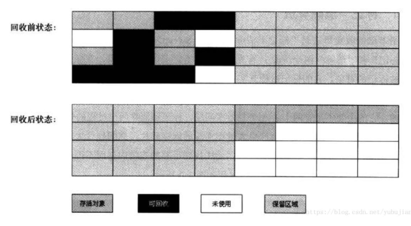
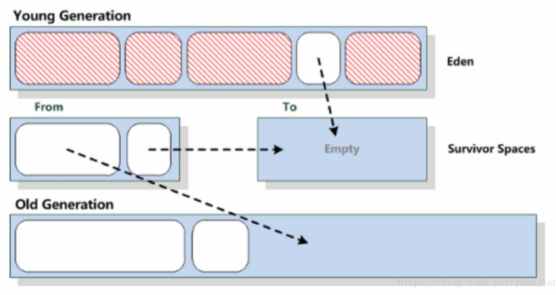
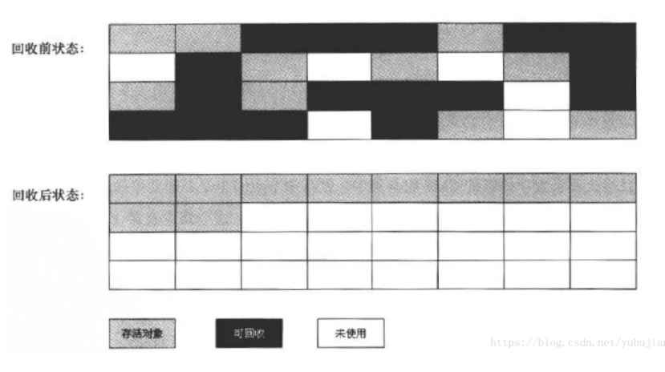

```
1.1 引用计数法
引用计数法描述的算法为：给对象增加一个引用计数器，每当有一个地方引用它时，计数器就+1；当引用失效时，计数器就-1；任何时刻计数器为0的对象就是不能再被使用的，即对象已“死”。
引用计数法实现简单，判定效率也比较高，在大部分情况下都是一个比较好的算法。比如Python语言就是采用的引用计数法来进行内存管理的。
但是，在主流的JVM中没有选用引用计数法来管理内存，最主要的原因是引用计数法无法解决对象的循环引用问题。

/**
  * JVM参数:-XX:+PrintGC
  *
*/
public class Test {
	public Object instance = null;
	private static int _1MB = 1024 * 1024;
	private byte[] bigSize = new byte[2 * _1MB];
	public static void testGC() {
		Test test1 = new Test();
		Test test2 = new Test();
		test1.instance = test2;
		test2.instance = test1;
		test1 = null;
		test2 = null;
		// 强制JVM进行垃圾回收
		System.gc();
	}
	public static void main(String[] args) {
		testGC();
	}
}
1.2 可达性分析算法
在上面讲了，Java并不采用引用计数法来判断对象是否已“死”，
而采用“可达性分析”来判断对象是否存活（同样采用此法的还有C#、Lisp-最早的一门采用动态内存分配的语言）。
此算法的核心思想：通过一系列称为“GC Roots”的对象作为起始点，
从这些节点开始向下搜索，搜索走过的路径称为“引用链”，
当一个对象到 GC Roots 没有任何的引用链相连时(从 GC Roots 到这个对象不可达)时，
证明此对象不可用。以下图为例：

```


```
对象Object5 —Object7之间虽然彼此还有联系，但是它们到 GC Roots 是不可达的，因此它们会被判定为可回收对象。

在Java语言中，可作为GC Roots的对象包含以下几种：

虚拟机栈(栈帧中的本地变量表)中引用的对象。
方法区中静态属性引用的对象
方法区中常量引用的对象
本地方法栈中(Native方法)引用的对象
在JDK1.2以前，Java中引用的定义很传统: 如果引用类型的数据中存储的数值代表的是另一块内存的起始地址，
就称这块内存代表着一个引用。这种定义有些狭隘，
一个对象在这种定义下只有被引用或者没有被引用两种状态。
我们希望能描述这一类对象: 当内存空间还足够时，
则能保存在内存中；如果内存空间在进行垃圾回收后还是非常紧张，
则可以抛弃这些对象。很多系统中的缓存对象都符合这样的场景。
在JDK1.2之后，Java对引用的概念做了扩充，将引用分为强引用(Strong Reference)、
软引用(Soft Reference)、弱引用(Weak Reference)和虚引用(Phantom Reference)四种，
这四种引用的强度依次递减。

强引用: 强引用指的是在程序代码之中普遍存在的，类似于"Object obj = new Object()"这类的引用，只要强引用还存在，垃圾回收器永远不会回收掉被引用的对象实例。

软引用: 软引用是用来描述一些还有用但是不是必须的对象。对于软引用关联着的对象，在系统将要发生内存溢出之前，会把这些对象列入回收范围之中进行第二次回收。如果这次回收还是没有足够的内存，才会抛出内存溢出异常。在JDK1.2之后，提供了SoftReference类来实现软引用。

弱引用: 弱引用也是用来描述非必需对象的。但是它的强度要弱于软引用。被弱引用关联的对象只能生存到下一次垃圾回收发生之前。当垃圾回收器开始进行工作时，无论当前内容是否够用，都会回收掉只被弱引用关联的对象。在JDK1.2之后提供了WeakReference类来实现弱引用。

虚引用: 虚引用也被称为幽灵引用或者幻影引用，它是最弱的一种引用关系。一个对象是否有虚引用的存在，完全不会对其生存时间构成影响，也无法通过虚引用来取得一个对象实例。为一个对象设置虚引用的唯一目的就是能在这个对象被收集器回收时收到一个系统通知。在JDK1.2之后，提供了PhantomReference类来实现虚引用。

```

```生存还是死亡？
即使在可达性分析算法中不可达的对象，也并非"非死不可"的，这时候他们暂时处在"缓刑"阶段。要宣告一个对象的真正死亡，至少要经历两次标记过程: 如果对象在进行可达性分析之后发现没有与GC Roots相连接的引用链，那它将会被第一次标记并且进行一次筛选，筛选的条件是此对象是否有必要执行finalize()方法。当对象没有覆盖finalize()方法或者finalize()方法已经被JVM调用过，虚拟机会将这两种情况都视为"没有必要执行"，此时的对象才是真正"死"的对象。
如果这个对象被判定为有必要执行finalize()方法，那么这个对象将会被放置在一个叫做F-Queue的队列之中，并在稍后由一个虚拟机自动建立的、低优先级的Finalizer线程去执行它（这里所说的执行指的是虚拟机会触发finalize()方法）。finalize()方法是对象逃脱死亡的最后一次机会，稍后GC将对F-Queue中的对象进行第二次小规模标记，如果对象在finalize()中成功拯救自己(只需要重新与引用链上的任何一个对象建立起关联关系即可)，那在第二次标记时它将会被移除出"即将回收"的集合；如果对象这时候还是没有逃脱，那基本上它就是真的被回收了。
public class Test {
	public static Test test;
	public void isAlive() {
		System.out.println("I am alive :)");
	}
	@Override
	protected void finalize() throws Throwable {
		super.finalize();
		System.out.println("finalize method executed!");
		test = this;
	}
	public static void main(String[] args)throws Exception {
		test = new Test();
		test = null;
		System.gc();
		Thread.sleep(500);
		if (test != null) {
			test.isAlive();
		}else {
			System.out.println("no,I am dead :(");
		}
		// 下面代码与上面完全一致，但是此次自救失败
		test = null;
		System.gc();
		Thread.sleep(500);
		if (test != null) {
			test.isAlive();
		}else {
			System.out.println("no,I am dead :(");
		}
	}
}
从上面代码示例我们发现，finalize方法确实被JVM触发，并且对象在被收集前成功逃脱。
但是从结果上我们发现，两个完全一样的代码片段，结果是一次逃脱成功，一次失败。这是因为，任何一个对象的finalize()方法都只会被系统自动调用一次，如果相同的对象在逃脱一次后又面临一次回收，它的finalize()方法不会被再次执行，因此第二段代码的自救行动失败。

```

```
2、回收方法区
方法区(永久代)的垃圾回收主要收集两部分内容：废弃常量和无用类。
回收废弃常量和回收Java堆中的对象十分类似。以常量池中字面量(直接量)的回收为例，假如一个字符串"abc"怡景进入了常量池中，但是当前系统没有任何一个String对象引用常量池中的"abc"常量，也没有其他地方引用这个字面量，如果此时发生GC并且有必要的话，这个"abc"常量会被系统清理出常量池。常量池中的其他类(接口)、方法、字段的符号引用也与此类似。
判定一个类是否是"无用类"则相对复杂很多。类需要同时满足下面三个条件才会被算是"无用的类"

1.该类的所有实例都已经被回收(即在Java堆中不存在任何该类的实例)
2.加载该类的ClassLoader已被回收
3.该类对应的Class对象没有任何其他地方被引用，无法在任何地方通过反射访问该类的方法

JVM可以对同时满足上述3个条件的无用类进行回收，也仅仅是“可以”而不是必然。在大量使用反射、动态代理等场景都需要JVM具备类卸载的功能来防止永久代的溢出。

```

```
3、垃圾回收算法
3.1 标记-清除算法
“标记-清除”算法是最基础的收集算法。算法分为标记和清除两个阶段：首先标记出所有需要回收的对象，在标记完成后统一回收所有被标记的对象(标记过程参见1.2可达性分析)。后续的收集算法都是基于这种思路并对其不足加以改进而已。
“标记-清除”算法的不足主要有两个：

效率问题：标记和清除这两个过程的效率都不高
空间问题：标记清除后会产生大量不连续的内存碎片，空间碎片太多可能会导致以后在程序运行中需要分配较大对象时，无法找到足够连续内存而不得不提前触发另一次垃圾收集。

```

```3.2 复制算法(新生代回收算法)
“复制”算法是为了解决“标记-清除”的效率问题。它将可用内存按容量划分为大小相等的两块，
每次只使用其中一块。当这块内存需要进行垃圾回收时，会将此区域还存活着的对象复制到另一块上面，
然后再把已经使用过的内存区域一次清理掉。这样做的好处是每次都是对整个半区进行内存回收，
内存分配时也就不需要考虑内存碎片等的复杂情况，只需要移动堆顶指针，按顺序分配即可。
此算法实现简单，运行高效。算法的执行流程如下图：
```


```现在的商用虚拟机(包括HotSpot)都是采用这种收集算法来回收新生代

新生代中98%的对象都是"朝生夕死"的，所以并不需要按照1 : 1的比例来划分内存空间，而是将内存(新生代内存)分为一块较大的Eden(伊甸园)空间和两块较小的Survivor(幸存者)空间，每次使用Eden和其中一块Survivor（两个Survivor区域一个称为From区，另一个称为To区域）。当回收时，将Eden和Survivor中还存活的对象一次性复制到另一块Survivor空间上，最后清理掉Eden和刚才用过的Survivor空间。
当Survivor空间不够用时，需要依赖其他内存(老年代)进行分配担保。
HotSpot默认Eden与Survivor的大小比例是8 : 1，也就是说Eden:Survivor From : Survivor To = 8:1:1。所以每次新生代可用内存空间为整个新生代容量的90%,而剩下的10%用来存放回收后存活的对象。

HotSpot实现的复制算法流程如下：

当Eden区满的时候，会触发第一次Minor gc，把还活着的对象拷贝到Survivor From区；
当Eden区再次出发Minor gc的时候，会扫描Eden区和From区，
对两个区域进行垃圾回收，经过这次回收后还存活的对象，则直接复制到To区域，
并将Eden区和From区清空。
当后续Eden区又发生Minor gc的时候，会对Eden区和To区进行垃圾回收
，存活的对象复制到From区，并将Eden区和To区清空
部分对象会在From区域和To区域中复制来复制去，
如此交换15次(由JVM参数MaxTenuringThreshold决定，这个参数默认是15)，
最终如果还存活，就存入老年代。
```


```3.3 标记整理算法(老年代回收算法)
复制收集算法在对象存活率较高时会进行比较多的复制操作，效率会变低。因此在老年代一般不能使用复制算法。
针对老年代的特点，提出了一种称之为“标记-整理算法”。标记过程仍与“标记-清除”过程一致，
但后续步骤不是直接对可回收对象进行清理，而是让所有存活对象向一端移动，
然后直接清理掉端边界以外的内存。流程图如下：
```


```
3.4 分代收集算法
当前JVM垃圾收集都采用的是"分代收集(Generational Collection)"算法，这个算法并没有新思想，只是根据对象存活周期的不同将内存划分为几块。
一般是把Java堆分为新生代和老年代。在新生代中，每次垃圾回收都有大批对象死去，只有少量存活，因此我们采用复制算法；而老年代中对象存活率高、没有额外空间对它进行分配担保，就必须采用"标记-清理"或者"标记-整理"算法。

面试题: 请问了解Minor GC和Full GC么，这两种GC有什么不一样吗？

Minor GC又称为新生代GC : 指的是发生在新生代的垃圾收集。因为Java对象大多都具备朝生夕灭的特性，因此Minor GC(采用复制算法)非常频繁，一般回收速度也比较快。
Full GC 又称为老年代GC或者Major GC : 指发生在老年代的垃圾收集。
出现了Major GC，经常会伴随至少一次的Minor GC(并非绝对，在Parallel Scavenge收集器中就有直接进行Full GC的策略选择过程)。
Major GC的速度一般会比Minor GC慢10倍以上。
```