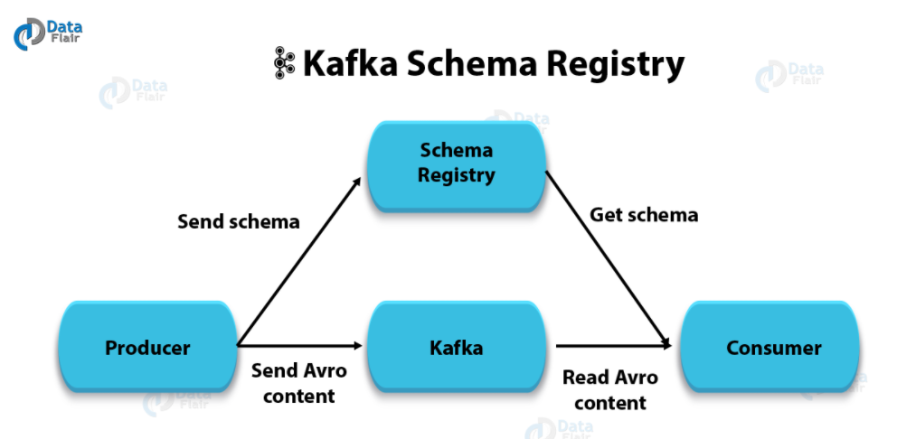

http://avro.apache.org/docs/current/gettingstartedjava.html
https://www.jianshu.com/p/cd6f413d35b0
URl: http://kafka.apache.org/quickstart
Schema Introduction: https://www.cnblogs.com/a00ium/p/10853032.html
https://blog.csdn.net/weixin_44575542/article/details/88594773

docker run -p 8081:8081  -e  SCHEMA_REGISTRY_KAFKASTORE_BOOTSTRAP_SERVERS=PLAINTEXT://127.0.0.1:9092 -e SCHEMA_REGISTRY_LISTENERS=http://0.0.0.0:8081 -e SCHEMA_REGISTRY_DEBUG=true confluentinc/cp-schema-registry:latest
#### STEP 1: GET KAFKA
$ tar -xzf kafka_2.13-2.7.0.tgz
$ cd kafka_2.13-2.7.0

#### STEP 2: START KAFKA ENVIRONMENT
$ bin/zookeeper-server-start.sh config/zookeeper.properties
  eg. D:\Tools\googleDownload\kafka_2.11-1.1\kafka_2.11-1.1.0>bin\windows\zookeeper-server-start.bat config\zookeeper.properties

bin/kafka-server-start.sh config/server.properties
   eg. D:\Tools\googleDownload\kafka_2.11-1.1\kafka_2.11-1.1.0>bin\windows\kafka-server-start.bat config\server.properties

#### STEP 3: CREATE A TOPIC TO STORE YOUR EVENTS
$ bin/kafka-topics.sh --create --topic quickstart-events --bootstrap-server localhost:9092
$ bin\windows\kafka-topics.bat --create --topic first-event --zookeeper localhost:2181 --partitions 1 --replication-factor 1
$ bin\windows\kafka-topics.bat --describe --topic first-event --zookeeper localhost:2181
$ bin\windows\kafka-topics.bat --create --topic user-event --zookeeper localhost:2181 --partitions 1 --replication-factor 1

$ bin/kafka-topics.sh --describe --topic quickstart-events --bootstrap-server localhost:9092

#### STEP 4: WRITE SOME EVENTS INTO THE TOPIC
$ bin/kafka-console-producer.sh --topic quickstart-events --bootstrap-server localhost:9092
$ bin\windows\kafka-console-producer.bat --topic first-event --broker-list localhost:9092

#### STEP 5: READ THE EVENTS
$ bin/kafka-console-consumer.sh --topic quickstart-events --from-beginning --bootstrap-server localhost:9092
$ bin\windows\kafka-console-consumer.bat --topic first-event --from-beginning  --bootstrap-server localhost:9092
$ bin\windows\kafka-console-consumer.bat --topic user-event --from-beginning  --bootstrap-server localhost:9092

https://data-flair.training/blogs/kafka-use-cases-applications/

