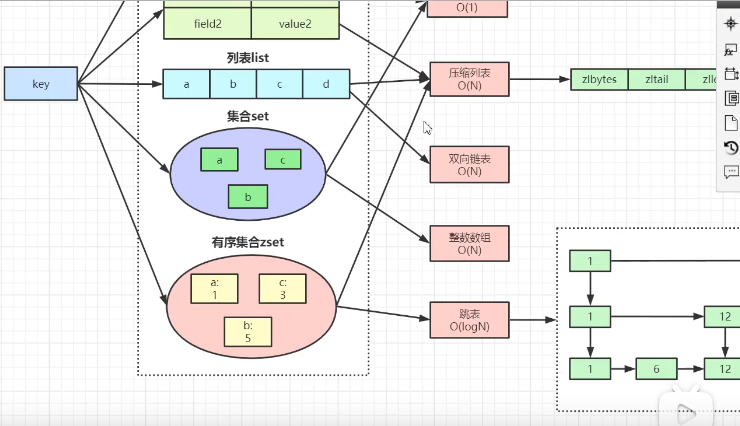
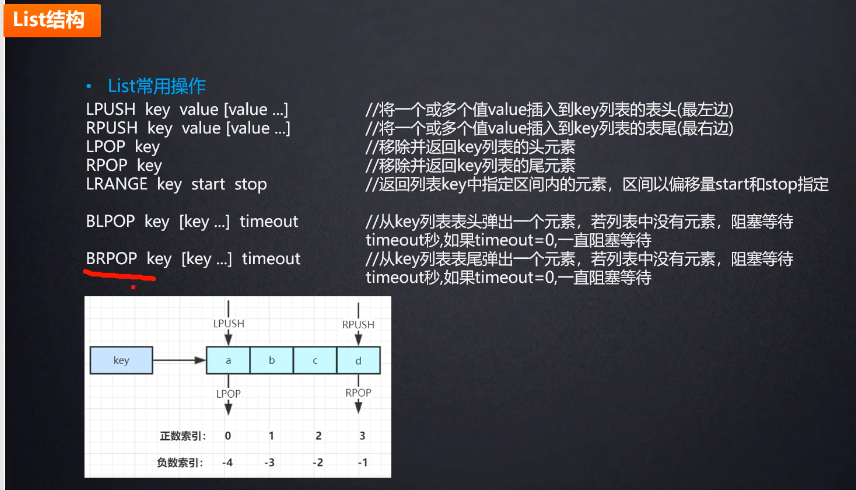
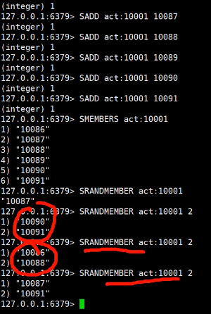
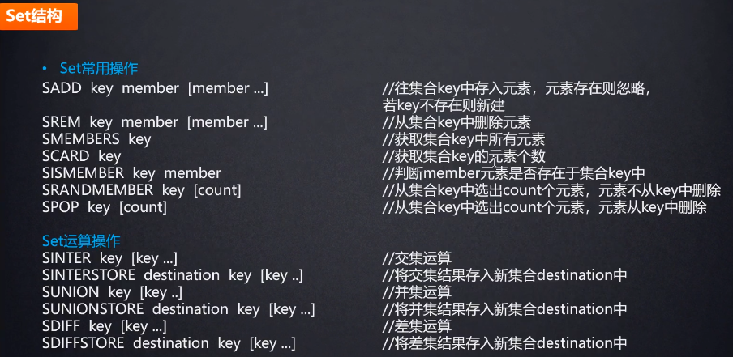
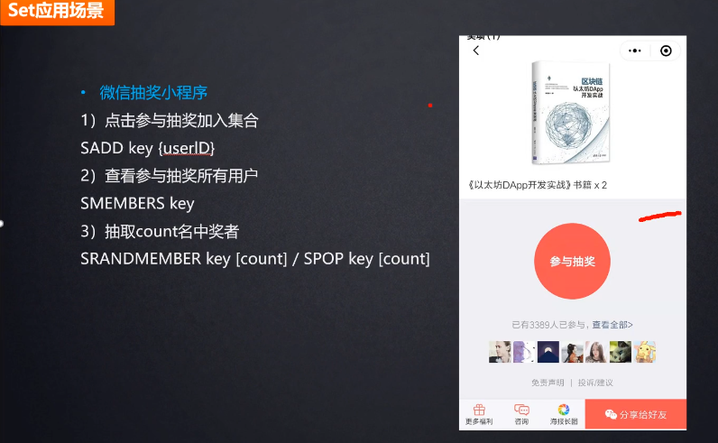
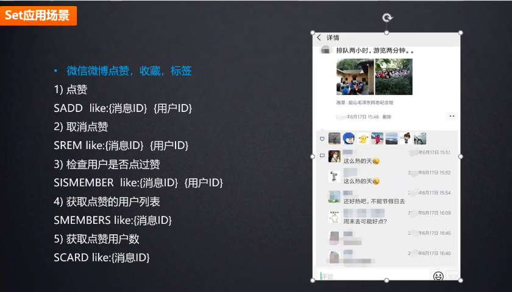
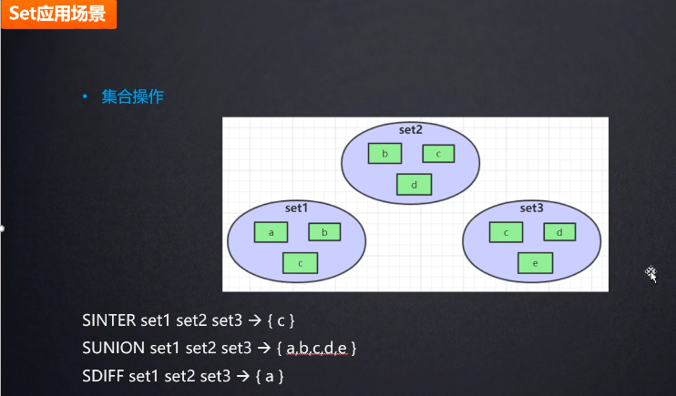
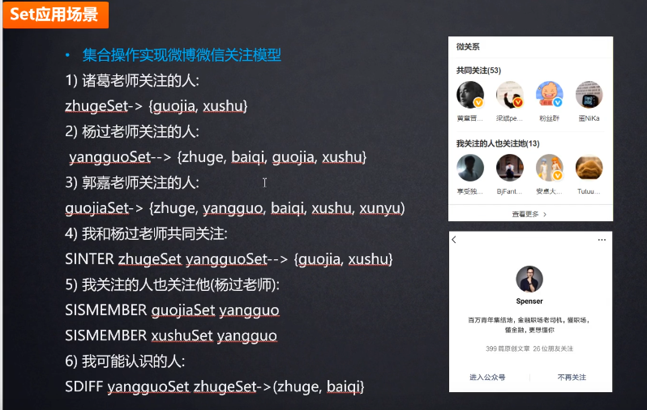
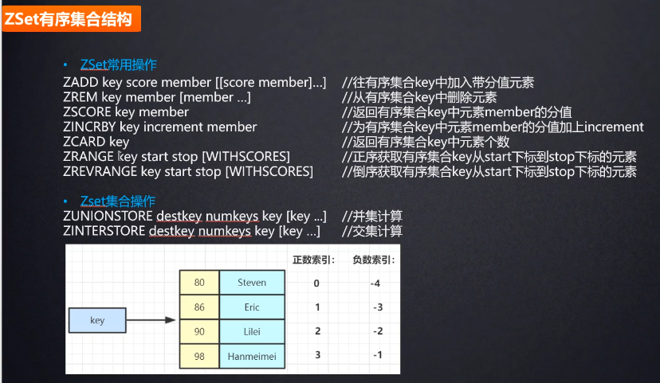
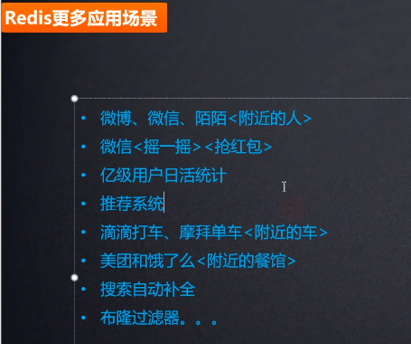

https://www.redis.net.cn/order/3546.html

```
redis-server.exe redis.windows.conf
redis-cli.exe
```


Stack(栈)=LPUSH + LPOP
Queue(队列)=LPUSH + RPOP
Blocking MQ(阻塞队列) + LPUSH + BRPOP








